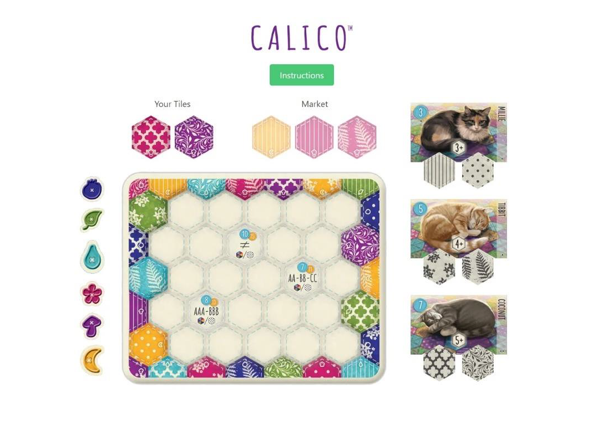
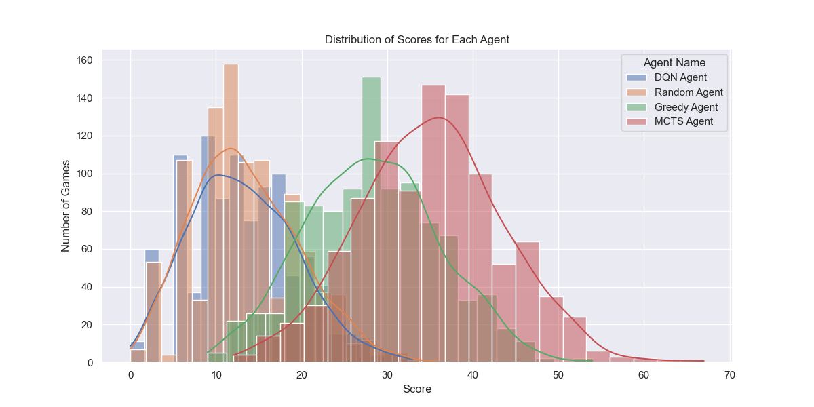
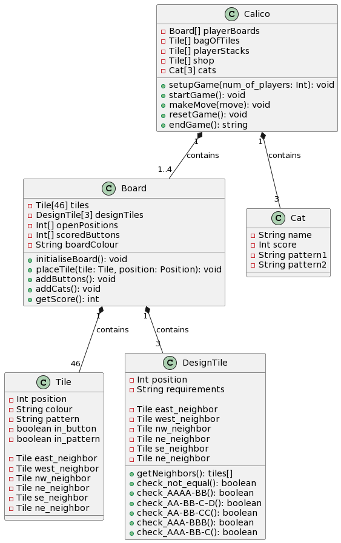

# AI Investigation in Non-Deterministic Board Games: Calico

## Introduction
Welcome to my project where we explore the application of AI in the board game Calico. This work involves creating AI agents that operate in a game environment characterized by non-determinism and complete information. The focus is on implementing and evaluating different AI strategies, including Random, Greedy, Monte Carlo Tree Search (MCTS), and Deep Q-Network (DQN). These agents are designed to tackle the strategic complexities of Calico, providing insights into how AI can adapt and make decisions in board games where randomness plays a key role alongside visible information.

## About the Game - Calico

Calico is a tile-placement board game where players compete to craft the coziest quilt and attract adorable cats to lie on it. The game combines elements of pattern recognition, strategic planning, and spatial reasoning. Players select and place hexagonal tiles of different colors and patterns onto their quilt board. The objective is to create groups of tiles that meet specific pattern requirements to attract cats, who each have their preferences for certain patterns and colors.

Each player's quilt board features a 7x7 grid where they strategically place their tiles. The game also includes unique 'design goal' tiles, which provide additional scoring opportunities when their specific conditions are met. Players score points by creating color and pattern combinations, completing design goals, and collecting buttons, a currency in the game used to craft more complex patterns.

Calico offers a blend of simplicity in its rules and depth in its strategic possibilities, making it appealing to a wide range of players. The game is praised for its thoughtful design, challenging puzzles, and charming aesthetic, which includes beautifully illustrated cats and colorful fabric tiles. It's a game of careful decision-making and foresight, as players balance the various scoring methods to build the most appealing quilt and become the ultimate quilt master.

## Objective
The project aims to implement a variety of AI algorithms that will play the nondeterministic
board game, Calico. The project will have two main fronts: the initial
digital implementation of the board game Calico, followed by the development,
training, and evaluation of AI agents on the game. These agents will be assessed
based on their performance in solo gameplay and their performance in competitive
match-ups against one another.
Additional analysis beyond the primary evaluation of the agents will be to evaluate
the game balance of Calico through the use of the AI agents. This will provide
insight that may not be immediately perceived by human gameplay.

## AI Agents Overview
- **Random Agent**: Agent that will play moves at random
- **Greedy Agent**: Agent that will follow the greedy stratergy of maximising immediate reward
- **Monte Carlo Tree Search (MCTS)**: Agent that will follow the MCTS process in determining next move
- **Deep Q-Network (DQN)**: Agent that will use a Deep Q-Network to determine the next best move

## Technologies Used
- Python
- Libraries: NumPy, PyTorch

## Results and Discussion
With the analysis of the results from the head-to-head games and the t-test, we
can confidently rank the agents based on their performance.
1. MCTS Agent
2. Greedy Agent
3. Random Agent and DQN Agent

The MCTS Agent clearly stands out in its ability to handle the complex environment
of Calico through game simulation. This performance highlights the power of
foresight. Following the MCTS Agent is the Greedy Agent, while not as robust as
the MCTS Agent, still illustrates that maximising for immediate reward can result
in reasonably good outcomes. The DQN Agent, unfortunately, played equivalent
to that of the Random Agent. However, the Random Agent shows that by random
play, one can still score points and, on rare occasions, win games.

The two potential areas that were investigated were: board colour and player turn order. The ANOVA results
suggested that neither board colour provided a significant advantage in the score.
Similarly, the t-test analysis for the first mover advantage between the two greedy
agents showed no statistically significant difference in their scores based on turn
order. Therefore, based on this analysis, Calico seems to be balanced in terms of
the boards and the order of turns. Future work might look further into specific
mechanics to find any potential advantages.

## Class Diagram

